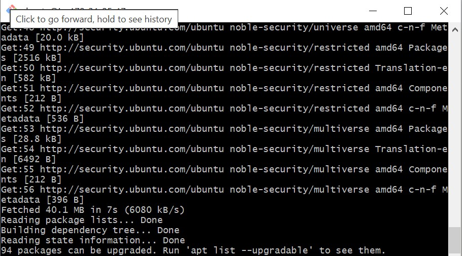
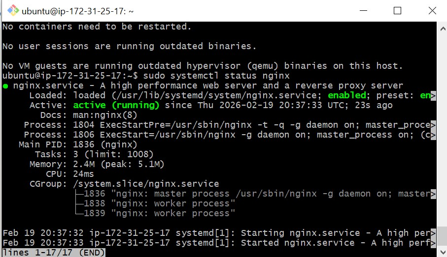
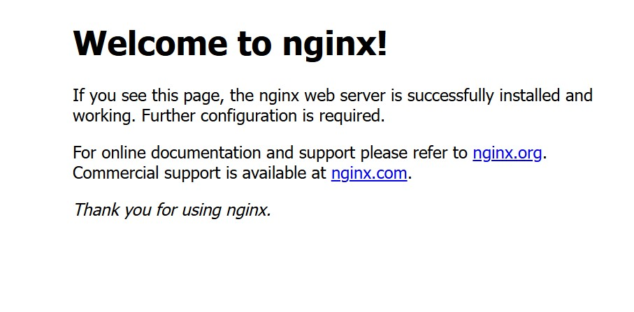
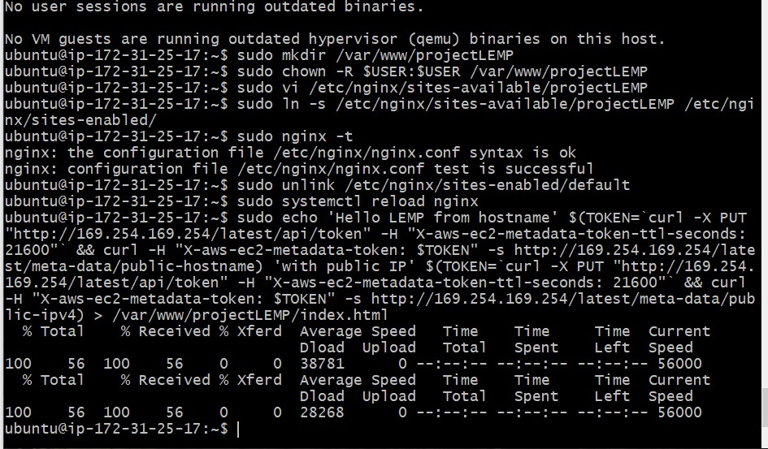
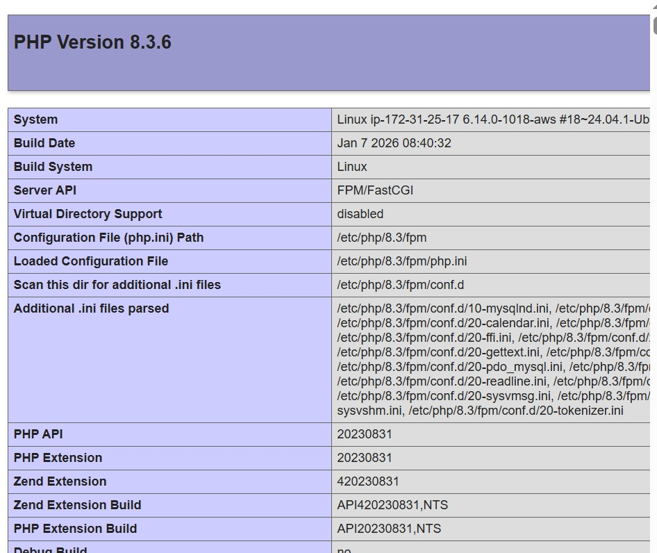
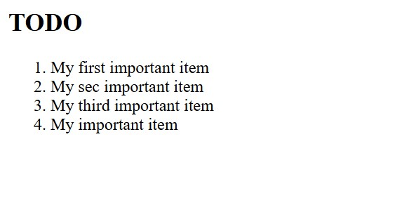

# LEMP Stack Project Documentation

## Table of Contents
1. [Project Overview](#project-overview)
2. [Architecture & Design Choices](#architecture--design-choices)
3. [Prerequisites](#prerequisites)
4. [Step-by-Step Setup](#step-by-step-setup)
   - [Step 1 – Install & Configure Nginx](#step-1--install--configure-nginx)
   - [Step 2 – Install & Secure MySQL](#step-2--install--secure-mysql)
   - [Step 3 – Install PHP](#step-3--install-php)
   - [Step 4 – Configure Nginx to Use PHP](#step-4--configure-nginx-to-use-php)
   - [Step 5 – Test the PHP Page](#step-5--test-the-php-page)
5. [Problem-Solving & Troubleshooting](#problem-solving--troubleshooting)
6. [Key Design Decisions](#key-design-decisions)
7. [Author](#author)

---

## Project Overview

This project demonstrates the end-to-end deployment of a **LEMP stack** — a modern, high-performance alternative to the traditional LAMP stack. LEMP replaces Apache with **Nginx**, offering better handling of concurrent connections and lower memory usage, making it a preferred choice for production web environments.

| Component | Technology | Role |
|-----------|-----------|------|
| **L**inux | Ubuntu 22.04 LTS | Operating System |
| **E**ngine-X | Nginx | Web Server |
| **M**ySQL | MySQL 8.0 | Relational Database |
| **P**HP | PHP 8.1 + PHP-FPM | Server-side Scripting |

**Project Goal:** Set up a fully functional LEMP stack on a Linux server, configure all components to communicate correctly, and serve a dynamic PHP web page — validating the entire stack is operational.

---

## Architecture & Design Choices

### Why LEMP over LAMP?

The decision to use **Nginx** instead of Apache comes down to a fundamental architectural difference:

- **Apache** uses a *process/thread-per-request* model — each incoming request spawns a new thread, which consumes memory and can slow down under high traffic.
- **Nginx** uses an *event-driven, asynchronous* model — it handles many connections within a single or small number of worker processes, making it significantly more efficient under load.

For this project, Nginx was chosen to reflect industry best practices and to gain hands-on experience with a web server that scales well in real-world deployments.

### Why PHP-FPM?

Unlike Apache (which can embed PHP via `mod_php`), Nginx cannot execute PHP natively. This is why **PHP-FPM (FastCGI Process Manager)** is used — it acts as a bridge, receiving requests from Nginx, processing the PHP, and returning the output. This separation of concerns also improves security and performance since PHP runs as its own isolated process.

### Stack Communication Flow

```
Client (Browser)
      │
      ▼
   Nginx (Port 80)
      │  passes .php requests via FastCGI
      ▼
   PHP-FPM (Unix Socket)
      │  queries the database
      ▼
   MySQL (Port 3306)
      │
      ▼
   Response back to Client
```

---

## Prerequisites

- A Linux server (Ubuntu 20.04 / 22.04 recommended)
- A user account with `sudo` privileges
- Basic familiarity with the Linux terminal

---

## Step-by-Step Setup

### Step 1 – Install & Configure Nginx

The first step is to update the package index and install Nginx, the web server that will handle all incoming HTTP requests.

```bash
# Update package list
sudo apt update

# Install Nginx
sudo apt install nginx -y

# Verify Nginx is running
sudo systemctl status nginx
```

**Design choice:** Nginx is started and enabled by default after installation, but it's good practice to confirm it with `systemctl status` before proceeding — this catches any port conflicts early (e.g., if another service is already using port 80).

Once installed, visiting your server's IP address in a browser should display the Nginx welcome page, confirming the web server is live.

#### 📸 Screenshot 1 – Terminal: Running `sudo apt update`
> _Should show the package list being fetched and updated successfully in the terminal. Look for "Hit", "Get", and "Fetched X MB" lines confirming the update ran without errors._



#### 📸 Screenshot 2 – Terminal: Nginx Status Active & Running
> _Should show the output of `sudo systemctl status nginx` with a green **"active (running)"** status, the process ID, and memory usage. This confirms Nginx started successfully._



#### 📸 Screenshot 3 – Browser: Nginx Default Welcome Page
> _Should show the **"Welcome to nginx!"** page in your browser when you visit `http://your-server-ip`. This confirms Nginx is serving web traffic correctly on port 80._



---

### Step 2 – Install & Secure MySQL

MySQL serves as the relational database backend. After installation, the `mysql_secure_installation` script is run to harden the default configuration.

```bash
# Install MySQL server
sudo apt install mysql-server -y

# Run the security script to set root password,
# remove anonymous users, and disable remote root login
sudo mysql_secure_installation
```

During `mysql_secure_installation`, the following choices were made:

| Prompt | Choice | Reason |
|--------|--------|--------|
| Validate Password Plugin | Yes | Enforces strong password policy |
| Remove anonymous users | Yes | Reduces attack surface |
| Disallow remote root login | Yes | Root should only be accessed locally |
| Remove test database | Yes | Unnecessary default database |
| Reload privilege tables | Yes | Applies all changes immediately |

```bash
# Verify MySQL is running
sudo systemctl status mysql

# Log in to confirm access
sudo mysql -u root -p
```

### Step 3 – Install PHP

Since Nginx doesn't process PHP natively, both `php-fpm` and `php-mysql` are installed. The `php-fpm` package allows Nginx to delegate PHP processing, while `php-mysql` enables PHP to communicate with MySQL.

```bash
# Install PHP-FPM and the PHP MySQL extension
sudo apt install php-fpm php-mysql -y

# Confirm the PHP-FPM version installed
php-fpm8.1 --version
```

**Why not just `php`?** Installing the plain `php` package on Ubuntu pulls in `libapache2-mod-php` as a dependency, which is Apache-specific. For a LEMP stack, only `php-fpm` is needed — keeping the setup clean and free of unnecessary Apache modules.

---

### Step 4 – Configure Nginx to Use PHP

By default, Nginx does not know to pass `.php` files to PHP-FPM. This requires editing the Nginx server block configuration.

```bash
# Open the default Nginx server block
sudo nano /etc/nginx/sites-available/default
```

The key sections to configure or uncomment in the file:

```nginx
server {
    listen 80 default_server;
    listen [::]:80 default_server;

    root /var/www/html;
    index index.php index.html index.htm;

    server_name _;

    location / {
        try_files $uri $uri/ =404;
    }

    # Pass PHP scripts to PHP-FPM
    location ~ \.php$ {
        include snippets/fastcgi-php.conf;
        fastcgi_pass unix:/run/php/php8.1-fpm.sock;
    }

    # Deny access to .htaccess files
    location ~ /\.ht {
        deny all;
    }
}
```

**Design choice – Unix socket vs TCP socket:** The `fastcgi_pass` directive uses a **Unix socket** (`unix:/run/php/php8.1-fpm.sock`) rather than a TCP address (`127.0.0.1:9000`). Unix sockets are faster for same-machine communication because they bypass the network stack entirely — reducing latency between Nginx and PHP-FPM.

```bash
# Test the Nginx config for syntax errors before reloading
sudo nginx -t

# Reload Nginx to apply changes
sudo systemctl reload nginx
```

Always run `nginx -t` before reloading — it catches configuration syntax errors and prevents accidentally taking down the web server.

#### 📸 Screenshot 4 – Terminal: Nginx Config File Being Edited
> _Should show the `nano` editor open with `/etc/nginx/sites-available/default`, with the PHP location block visible — specifically the `location ~ \.php$` section and the `fastcgi_pass` line pointing to the PHP-FPM socket._


---

### Step 5 – Test the PHP Page

A simple PHP info file is created to verify the full stack is working end-to-end.

```bash
# Create a PHP test file in the web root
sudo nano /var/www/html/info.php
```

```php
<?php
phpinfo();
?>
```

Navigate to `http://your-server-ip/info.php` in a browser. A successful result shows the PHP Info page, confirming that:

- ✅ Nginx is receiving and routing the request
- ✅ PHP-FPM is processing the PHP code
- ✅ The full LEMP stack is communicating correctly

```bash
# After confirming, remove the info.php file for security
# (it exposes sensitive server configuration details)
sudo rm /var/www/html/info.php
```

**Security note:** The `phpinfo()` page reveals detailed information about the server environment. It should always be removed after testing and never left on a production server.

#### 📸 Screenshot 5 – Terminal: Creating the `info.php` File
> _Should show the terminal after running `sudo nano /var/www/html/info.php` with the `<?php phpinfo(); ?>` content visible inside the nano editor, before saving._


#### 📸 Screenshot 6 – Browser: PHP Info Page (Full Stack Confirmed)
> _Should show the full **PHP Info** page rendered in the browser at `http://your-server-ip/info.php`. Key things visible should include the PHP version at the top, the **Server API** field showing **"FPM/FastCGI"** (confirming PHP-FPM is handling requests), and the Nginx server software listed. This is the most important screenshot — it proves the entire LEMP stack is working end-to-end._



#### 📸 Screenshot 7 – Browser: Final Working Web Page
> _Should show your final custom web page (not the phpinfo page) served by the LEMP stack in the browser — confirming the stack is ready to serve real content. This could be a custom `index.php` or `index.html` you created as the final deliverable._




## Problem-Solving & Troubleshooting

### Common Issues Encountered

#### 1. 502 Bad Gateway Error
**Symptom:** Browser shows `502 Bad Gateway` after configuring Nginx for PHP.

**Cause:** The `fastcgi_pass` socket path in the Nginx config doesn't match the actual PHP-FPM socket path.

**Fix:** Confirm the correct socket path and update the config:
```bash
# Find the actual PHP-FPM socket path
ls /run/php/

# Update nginx config to match (e.g., php8.1-fpm.sock)
sudo nano /etc/nginx/sites-available/default

# Reload after fixing
sudo systemctl reload nginx

---

#### 2. Nginx Config Test Fails (`nginx -t`)
**Symptom:** `nginx -t` returns a syntax error.

**Cause:** A missing semicolon, bracket, or incorrect directive in the config file.

**Fix:** Read the error message carefully — Nginx points to the exact line number. Re-open the config file and correct the syntax before reloading.

#### 📸 Screenshot – Terminal: `nginx -t` Syntax Error Message
> _Should show the red error output from `sudo nginx -t` pointing to the exact file and line number of the syntax mistake — useful to demonstrate how to read and interpret Nginx error messages._


---

## Key Design Decisions

| Decision | Choice Made | Reason |
|----------|------------|--------|
| Web Server | Nginx | Better performance under concurrent load vs Apache |
| PHP Handler | PHP-FPM | Required for Nginx; also more secure and scalable |
| FPM Communication | Unix socket | Lower latency than TCP for same-server communication |
| PHP test file | Deleted after testing | `phpinfo()` exposes sensitive server details |
| MySQL hardening | `mysql_secure_installation` | Removes defaults that are insecure in production |

---

## Author

> _Add your name and GitHub profile link here_

---

*Project submitted as part of a LEMP Stack deployment exercise.*
